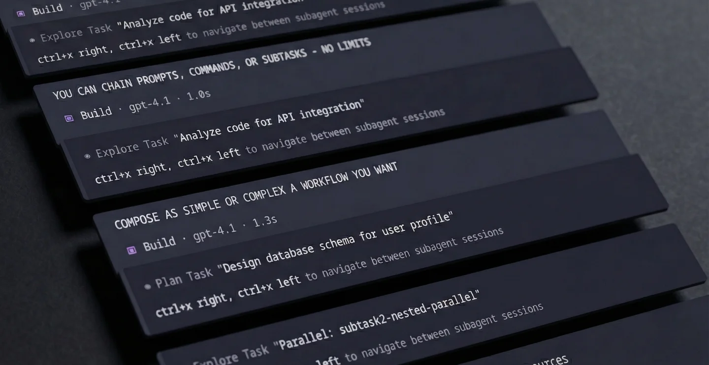
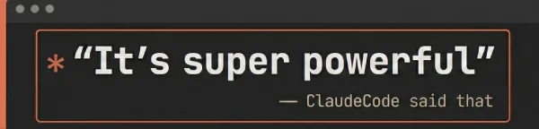

## Extend opencode `/commands` into a powerful orchestration system

### TL:DR - A less entropic agentic loop with more control

This plugin allows your opencode `/commands` to:

- **Chain** `prompts`, `/commands` and `subagents`
- **Relay** selective session context to subagents
- **Loop** or **parallelize** tasks
- **Steer** the outcome of the agentic flow
- **Transform** flows into workflows

If you already know opencode `/commands`, you'll be right at home, if not, start with [opencode's docs](https://opencode.ai/docs/commands/)




**To install**, add subtask2 to your opencode configuration

```json
{
  "plugins": ["@openspoon/subtask2@latest"]
}
```

---

<details>
<summary><strong>Feature documentation</strong></summary>

### Key Features

- `return` instruct main session on command/subtask(s) result - _can be chained_
- `loop` loop subtask until user condition is met
- `parallel` run subtasks concurrently - _pending PR ⚠️_
- `arguments` pass arguments with command frontmatter or `||` message pipe - _to any command_
- `$TURN[n]` pass session turns (user/assistant messages) - _selective context feedback_
- `agent`/`model`/`loop` inline override and subtask trigger

Requires [this PR](https://github.com/sst/opencode/pull/6478) for `parallel` features, as well as proper model inheritance (piping the right model and agent to the right subtask and back) to work.

### 1. `return` - Or the old 'look again' trick

Use `return` to tell the main agent what to do after a command completes, supports chaining and triggering other commands. The `return` prompt is appended to the main session on command or subtask completion.

```yaml
subtask: true
return: Look again, challenge the findings, then implement the valid fixes.
---
Review the PR# $ARGUMENTS for bugs.
```

For multiple sequential prompts, use an array:

```yaml
subtask: true
return:
  - Implement the fix
  - Run the tests
---
Find the bug in auth.ts
```

**Trigger /commands in return** using `/command args` syntax:

```yaml
subtask: true
return:
  - /revise-plan make the UX as horribly impractical as imaginable
  - /implement-plan
  - Send this to my mother in law
---
Design the auth system for $ARGUMENTS
```

By default, opencode injects a user message after a `subtask: true` completes, asking the model to "summarize the task tool output..." - Subtask2 replaces that message with the `return` prompt

- **First** `return` replaces opencode's "summarize" message or fires as a follow-up
- **Any additional** `return` fire sequentially after each LLM turn completes - _accepts /commands_
- **Commands** (starting with `/`) are executed as full commands with their own `parallel` and `return`

**Note:** The first `return` of a `subtask: true` command cannot be a slash command as it subsitutes the opencode injected message (as a string)

### 2. `{model:...}` - Inline model override ⚠️ **PENDING PR**

Override the model for any command invocation without modifying the command file. Attach the override directly to the command name with no space:

```bash
/plan{model:anthropic/claude-sonnet-4} design auth system
```

```yaml
return:
  - /plan{model:github-copilot/claude-sonnet-4.5}
  - /plan{model:openai/gpt-5.2}
  - Compare both plans and pick the best approach
```

This lets you reuse a single command template with different models - no need to duplicate commands just to change the model.

**Syntax:** `{model:provider/model-id}` - must be attached directly to the command (no space). Use `&&` to separate multiple overrides.

**Priority:** inline `{model:...}` > frontmatter `model:` field

### 2b. `{agent:...}` - Inline agent override

Override the agent for any command invocation:

```bash
/research{agent:explore} find auth patterns
```

```yaml
return:
  - /implement{agent:build}
  - /review{agent:plan}
```

**Syntax:** `{agent:agent-name}` - can be combined with other overrides using `&&`.

### 2c. `/subtask{...} prompt` - Inline subtasks

Create a subtask directly in return chains or chat without needing a command file. Use `/subtask{...}` followed by your prompt:

```yaml
return:
  - /subtask{loop:10 && until:tests pass} Fix failing tests and run the suite
  - /subtask{model:openai/gpt-4o && agent:build} Implement the feature
  - Summarize what was done
```

**Combining overrides:**

```yaml
return:
  - /subtask{model:anthropic/claude-sonnet-4 && agent:build && loop:5 && until:all done} Implement and verify the auth system
```

**Inline returns** - chain returns directly within inline subtasks:

```yaml
return:
  - /subtask{return:validate the output || run tests || deploy} implement the feature
```

Returns execute in order after the subtask completes, before continuing with the parent chain.

**When to use:**

- Quick one-off subtasks that don't need a reusable command file
- Inline loops with specific conditions
- Mixing models/agents in a single workflow

**Syntax:** `/subtask{key:value && ...} prompt text` - the `/subtask` prefix with `{` indicates an inline subtask. Use `&&` to separate parameters, and `||` to separate multi-value params like `return:` and `parallel:`.

### 2d. `/subtask prompt` - Simple inline subtasks from chat

For simple subtasks without overrides:

```bash
/subtask tell me a joke                                                # simple subtask
/subtask{model:openai/gpt-4o} analyze this code                        # with model override
/subtask{agent:build && loop:3 && until:all tests pass} fix tests      # with agent + loop
```

This lets you spawn ad-hoc subtasks without creating command files or using return chains.

### 3. `{loop:N}` and `{loop:N && until:X}` - Loop control

Run a command repeatedly, either a fixed number of times or until a condition is satisfied.

**Unconditional loop (fixed iterations):**

```bash
/generate-tests{loop:5} generate unit tests for auth module
```

Runs exactly 5 times with no evaluation - the main session just yields between iterations.

**Conditional loop (with evaluation):**

```bash
/fix-tests{loop:10 && until:all tests pass with good coverage}
```

**Frontmatter:**

```yaml
---
loop:
  max: 10
  until: "all features implemented correctly"
---
Implement the auth system.
```

**In return chains:**

```yaml
return:
  - /implement-feature
  - /fix-tests{loop:5 && until:tests are green}
  - /commit
```

**How it works (orchestrator-decides pattern):**

1. Subtask runs and completes
2. Main session receives evaluation prompt with the condition
3. Main LLM evaluates: reads files, checks git, runs tests if needed
4. Responds with `<subtask2 loop="break"/>` (satisfied) or `<subtask2 loop="continue"/>` (more work needed)
5. If continue → loop again. If break → proceed to next step
6. Max iterations is a safety net

**Why this works:**

- The main session (orchestrator) has full context of what was done
- It can verify by reading actual files, git diff, test output
- No fake "DONE" markers - real evaluation of real conditions
- The `until:` is a human-readable condition, not a magic keyword

**Best practices:**

- Write clear conditions: `until: "tests pass"` not `until: "DONE"`
- Always set a reasonable `max` as a safety net
- The condition is shown to the evaluating LLM verbatim

**Priority:** inline `{loop:...}` > frontmatter `loop:`

### 4. `parallel` - Run multiple subtasks concurrently ⚠️ **PENDING PR**

Spawn additional command subtasks alongside the main one:

`plan.md`

```yaml
subtask: true
parallel:
  - /plan-gemini
  - /plan-opus
return:
  - Compare and challenge the plans, keep the best bits and make a unified proposal
  - Critically review the plan directly against what reddit has to say about it
---
Plan a trip to $ARGUMENTS.
```

This runs 3 subtasks in parallel:

1. The main command (`plan.md`)
2. `plan-gemini`
3. `plan-opus`

When ALL complete, the main session receives the `return` prompt of the main command

### With custom arguments per command

You can pass arguments inline when using the command with `||` separators.
Pipe segments map in chronological order: main → parallels → return /commands

```bash
/mycommand main args || pipe1 || pipe2 || pipe3
```

and or

```yaml
parallel:
  - command: research-docs
    arguments: authentication flow
  - command: research-codebase
    arguments: auth middleware implementation
  - /security-audit
return: Synthesize all findings into an implementation plan.
```

- `research-docs` gets "authentication flow" as `$ARGUMENTS`
- `research-codebase` gets "auth middleware implementation"
- `security-audit` inherits the main command's `$ARGUMENTS`

You can use `/command args` syntax for inline arguments:

```yaml
parallel: /security-review focus on auth, /perf-review check db queries
```

Or for all commands to inherit the main `$ARGUMENTS`:

```yaml
parallel: /research-docs, /research-codebase, /security-audit
```

**Note:** Parallel commands are forced into subtasks regardless of their own `subtask` setting. Their `return` are ignored - only the parent's `return` applies. Nested parallels are automatically flattened (max depth: 5).

#### Priority: pipe args > frontmatter args > inherit main args

### 5. Subtask `return` fallback and custom defaults

For `subtask: true` commands, this plugin replaces the opencode generic "summarize" message with the `return` prompt. If undefined and `"replace_generic": true`, subtask2 uses:

> Review, challenge and validate the task output against the codebase then continue with the next logical step.

Configure in `~/.config/opencode/subtask2.jsonc`:

```jsonc
{
  // Replace generic prompt when no 'return' is specified
  "replace_generic": true, // defaults to true

  // Custom fallback (optional - has built-in default)
  "generic_return": "custom return prompt"
}
```

#### Priority: `return` param > config `generic_return` > built-in default > opencode original

### 6. `$TURN[n]` - Reference previous conversation turns

Use `$TURN[n]` to inject the last N conversation turns (user + assistant messages) into your command. This is powerful for commands that need context from the ongoing conversation.

```yaml
---
description: summarize our conversation so far
subtask: true
---
Review the following conversation and provide a concise summary:

$TURN[10]
```

**Syntax options:**

- `$TURN[6]` - last 6 messages
- `$TURN[:3]` - just the 3rd message from the end
- `$TURN[:2:5:8]` - specific messages at indices 2, 5, and 8
- `$TURN[*]` - all messages in the session

**Usage in arguments:**

```bash
/my-command analyze this $TURN[5]
```

**Syntax:**

- `$TURN[12]` - last 12 messages (turns, not parts)
- `$TURN[:3]` - just the 3rd message from the end
- `$TURN[:2:5:8]` - specific messages at indices 2, 5, and 8 from the end

**Format output:**

```
--- USER ---
What's the best way to implement auth?

--- ASSISTANT ---
I'd recommend using JWT tokens with...

--- USER ---
Can you show me an example?
...
```

Works in:

- Command body templates
- Command arguments
- Parallel command prompts
- Piped arguments (`||`)

### 7. `subtask2: auto` - Dynamic Workflow Generation

Let the LLM create and execute workflows dynamically:

```yaml
---
description: auto-generate and execute a workflow
agent: build
model: openai/gpt-4o
subtask2: auto
---
$ARGUMENTS
```

**Usage:**

```bash
/auto-workflow build a multi-model planning system with validation
```

The LLM will:

1. Analyze your request
2. Generate an appropriate workflow using inline syntax
3. Execute that workflow automatically

**How it works:**

The auto mode spawns a subtask that teaches the LLM the subtask2 inline syntax. The LLM then generates a `/subtask{...}` command inside `<subtask2 auto="true">...</subtask2>` tags. This generated command is parsed and executed automatically.

**Example generated workflow:**

```
<subtask2 auto="true">
/subtask{model:openai/gpt-4o && return:validate the implementation || run all tests || commit if green} implement the auth system with JWT tokens
</subtask2>
```

**Note:** `return`, `parallel`, and `$TURN` frontmatter fields are ignored in auto commands - the LLM generates these dynamically.

</details>

<details>
<summary><strong>Some examples</strong></summary>

**Parallel subtask with different models (A/B/C plan comparison)**

```yaml
---
description: multi-model ensemble, 3 models plan in parallel, best ideas unified
model: github-copilot/claude-opus-4.5
subtask: true
parallel: /plan-gemini, /plan-gpt
return:
  - Compare all 3 plans and validate each directly against the codebase. Pick the best ideas from each and create a unified implementation plan.
  - /review-plan focus on simplicity and correctness
---
Plan the implementation for the following feature
> $ARGUMENTS
```

**Isolated "Plan" mode**

```yaml
---
description: two-step implementation planning and validation
agent: build
subtask: true
return:
  - Challenge, verify and validate the plan by reviewing the codebase directly. Then approve, revise, or reject the plan. Implement if solid
  - Take a step back, review what was done/planned for correctness, revise if needed
---
In this session you WILL ONLY PLAN AND NOT IMPLEMENT. You are to take the `USER INPUT` and research the codebase until you have gathered enough knowledge to elaborate a full fledged implementation plan

You MUST consider alternative paths and keep researching until you are confident you found the BEST possible implementation

BEST often means simple, lean, clean, low surface and coupling
Make it practical, maintainable and not overly abstracted

Follow your heart
> DO NOT OVERENGINEER SHIT

USER INPUT
$ARGUMENTS
```

**Multi-step workflow**

```yaml
---
description: design, implement, test, document
agent: build
model: github-copilot/claude-opus-4.5
subtask: true
return:
  - Implement the component following the conceptual design specifications.
  - Write comprehensive unit tests for all edge cases.
  - Update the documentation and add usage examples.
  - Run the test suite and fix any failures.
---
Conceptually design a React modal component with the following requirements
> $ARGUMENTS
```

</details>
